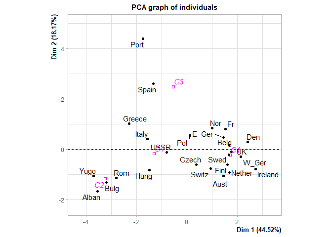
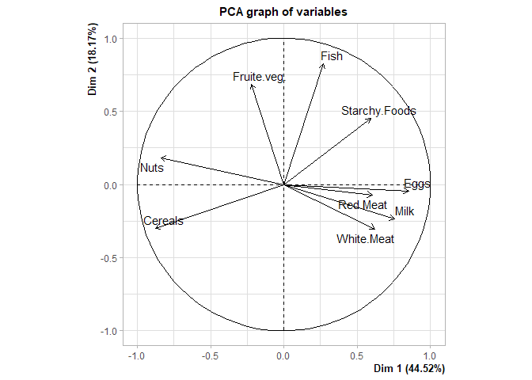
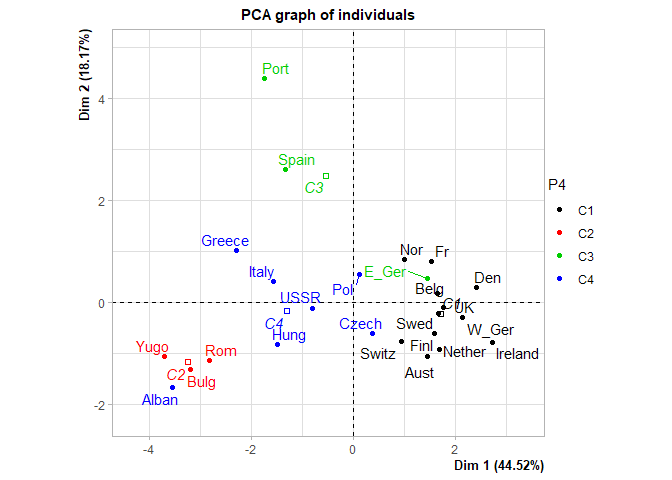

Définition des options générales de knitr.

```r
#knitr::opts_chunk$set(echo = T, message=F, eval=F, warning = F) # pour éditer le sujet
knitr::opts_chunk$set(echo = T, message=F, eval=T, warning = F) # pour éditer la correction
```

# Récupération des données

A partir du fichier texte, on vérifie d'abord que le fichier est bien accessible :

```r
dir()
```

```
## [1] "ind1234.txt"    "TP_Kmeans.html" "TP_Kmeans.Rmd"
```
Puis on l'importe : 

```r
X<-read.table(file="ind1234.txt",sep="\t",header=TRUE,dec=",",row.names=1)
```

Affichage pour vérification :

```r
X
```

<div data-pagedtable="false">
  <script data-pagedtable-source type="application/json">
{"columns":[{"label":[""],"name":["_rn_"],"type":[""],"align":["left"]},{"label":["var1"],"name":[1],"type":["int"],"align":["right"]},{"label":["var2"],"name":[2],"type":["int"],"align":["right"]}],"data":[{"1":"5","2":"4","_rn_":"ind1"},{"1":"4","2":"5","_rn_":"ind2"},{"1":"1","2":"-2","_rn_":"ind3"},{"1":"0","2":"-3","_rn_":"ind4"}],"options":{"columns":{"min":{},"max":[10]},"rows":{"min":[10],"max":[10]},"pages":{}}}
  </script>
</div>

# Calcul des distances 

```r
d=dist(X)
d
```

```
##          ind1     ind2     ind3
## ind2 1.414214                  
## ind3 7.211103 7.615773         
## ind4 8.602325 8.944272 1.414214
```


# CENTRES MOBILES (K-MEANS) SUR L'EXERCICE DE TD
Pour avoir une aide sur la fonction kmeans :

```r
help(kmeans)
```

## Initialisation


```r
init<-X[1:2,] 
```
ind1 et ind2 sont les centres initiaux

ou bien :

```r
init=X[c(1,2),]
```

Vérification :

```r
init
```

<div data-pagedtable="false">
  <script data-pagedtable-source type="application/json">
{"columns":[{"label":[""],"name":["_rn_"],"type":[""],"align":["left"]},{"label":["var1"],"name":[1],"type":["int"],"align":["right"]},{"label":["var2"],"name":[2],"type":["int"],"align":["right"]}],"data":[{"1":"5","2":"4","_rn_":"ind1"},{"1":"4","2":"5","_rn_":"ind2"}],"options":{"columns":{"min":{},"max":[10]},"rows":{"min":[10],"max":[10]},"pages":{}}}
  </script>
</div>

## Appel de la fonction kmeans
avec ind1 et ind2 comme centres initiaux 


```r
result=kmeans(X,centers=init) 
```


```r
result
```

```
## K-means clustering with 2 clusters of sizes 2, 2
## 
## Cluster means:
##   var1 var2
## 1  0.5 -2.5
## 2  4.5  4.5
## 
## Clustering vector:
## ind1 ind2 ind3 ind4 
##    2    2    1    1 
## 
## Within cluster sum of squares by cluster:
## [1] 1 1
##  (between_SS / total_SS =  97.0 %)
## 
## Available components:
## 
## [1] "cluster"      "centers"      "totss"        "withinss"     "tot.withinss"
## [6] "betweenss"    "size"         "iter"         "ifault"
```

## Affichage de la partition

```r
P2 <- result$cluster
P2
```

```
## ind1 ind2 ind3 ind4 
##    2    2    1    1
```

## Inertie totale

```r
result$totss
```

```
## [1] 67
```

## Inertie intra-classe W

```r
result$tot.withinss
```

```
## [1] 2
```

## Inertie inter-classes B

```r
result$betweenss
```

```
## [1] 65
```

## Pourcentage d'Inertie expliqué par la partition

```r
round((1-result$tot.withinss/result$totss)*100,2)
```

```
## [1] 97.01
```

## Nombre d'individus dans chaque classe

```r
result$size
```

```
## [1] 2 2
```

## Nombre d'itérations

```r
result$iter 
```

```
## [1] 1
```
 
# CENTRES MOBILES (K-MEANS) SUR L'EXEMPLE DU COURS (PROTEIN)

## Récupération et affichage des données


```r
library(PCAmixdata)
data(protein)
head(protein)
```

<div data-pagedtable="false">
  <script data-pagedtable-source type="application/json">
{"columns":[{"label":[""],"name":["_rn_"],"type":[""],"align":["left"]},{"label":["Red.Meat"],"name":[1],"type":["dbl"],"align":["right"]},{"label":["White.Meat"],"name":[2],"type":["dbl"],"align":["right"]},{"label":["Eggs"],"name":[3],"type":["dbl"],"align":["right"]},{"label":["Milk"],"name":[4],"type":["dbl"],"align":["right"]},{"label":["Fish"],"name":[5],"type":["dbl"],"align":["right"]},{"label":["Cereals"],"name":[6],"type":["dbl"],"align":["right"]},{"label":["Starchy.Foods"],"name":[7],"type":["dbl"],"align":["right"]},{"label":["Nuts"],"name":[8],"type":["dbl"],"align":["right"]},{"label":["Fruite.veg."],"name":[9],"type":["dbl"],"align":["right"]}],"data":[{"1":"10.1","2":"1.4","3":"0.5","4":"8.9","5":"0.2","6":"42.3","7":"0.6","8":"5.5","9":"1.7","_rn_":"Alban"},{"1":"8.9","2":"14.0","3":"4.3","4":"19.9","5":"2.1","6":"28.0","7":"3.6","8":"1.3","9":"4.3","_rn_":"Aust"},{"1":"13.5","2":"9.3","3":"4.1","4":"17.5","5":"4.5","6":"26.6","7":"5.7","8":"2.1","9":"4.0","_rn_":"Belg"},{"1":"7.8","2":"6.0","3":"1.6","4":"8.3","5":"1.2","6":"56.7","7":"1.1","8":"3.7","9":"4.2","_rn_":"Bulg"},{"1":"9.7","2":"11.4","3":"2.8","4":"12.5","5":"2.0","6":"34.3","7":"5.0","8":"1.1","9":"4.0","_rn_":"Czech"},{"1":"10.6","2":"10.8","3":"3.7","4":"25.0","5":"9.9","6":"21.9","7":"4.8","8":"0.7","9":"2.4","_rn_":"Den"}],"options":{"columns":{"min":{},"max":[10]},"rows":{"min":[10],"max":[10]},"pages":{}}}
  </script>
</div>
Les données décrivent la quantité de protéines consommée dans 9 types d’aliments dans 25 pays européens : 25 individus et 9 variables quantitatives.

## Algorithme des centres mobiles pour obtenir une partition en 4 classes 
On lance l'algo 5 fois avec initialisation aléatoire :


```r
res <- kmeans(protein,centers=4,nstart=5) 
P4 <- res$cluster
P4
```

```
##   Alban    Aust    Belg    Bulg   Czech     Den   E_Ger    Finl      Fr  Greece 
##       4       1       1       2       4       1       3       1       1       4 
##    Hung Ireland   Italy  Nether     Nor     Pol    Port     Rom   Spain    Swed 
##       4       1       4       1       1       4       3       2       3       1 
##   Switz      UK    USSR   W_Ger    Yugo 
##       1       1       4       1       2
```

## Pourcentage d'Inertie expliqué par la partition

```r
round((1-res$tot.withinss/res$totss)*100,2)
```

```
## [1] 75.8
```

## ACP normée pour visualiser les classes et mieux les interpréter


### Création d'une variable qualitative contenant la classe Ck d'appartenance de chaque individu donnée par P4 

```r
str(P4) #P4 contient pour l'instant des entiers
```

```
##  Named int [1:25] 4 1 1 2 4 1 3 1 1 4 ...
##  - attr(*, "names")= chr [1:25] "Alban" "Aust" "Belg" "Bulg" ...
```

```r
P4<-as.factor(P4)
P4
```

```
##   Alban    Aust    Belg    Bulg   Czech     Den   E_Ger    Finl      Fr  Greece 
##       4       1       1       2       4       1       3       1       1       4 
##    Hung Ireland   Italy  Nether     Nor     Pol    Port     Rom   Spain    Swed 
##       4       1       4       1       1       4       3       2       3       1 
##   Switz      UK    USSR   W_Ger    Yugo 
##       1       1       4       1       2 
## Levels: 1 2 3 4
```

```r
str(P4) #P4 est maintenant une variable quali
```

```
##  Factor w/ 4 levels "1","2","3","4": 4 1 1 2 4 1 3 1 1 4 ...
##  - attr(*, "names")= chr [1:25] "Alban" "Aust" "Belg" "Bulg" ...
```

```r
levels(P4)<-paste("C",1:4,sep="") 
levels(P4) #la valeur k devient maintenant Ck
```

```
## [1] "C1" "C2" "C3" "C4"
```

### Affichage des contenus de chaque classe

```r
pays=row.names(protein)
pays
```

```
##  [1] "Alban"   "Aust"    "Belg"    "Bulg"    "Czech"   "Den"     "E_Ger"  
##  [8] "Finl"    "Fr"      "Greece"  "Hung"    "Ireland" "Italy"   "Nether" 
## [15] "Nor"     "Pol"     "Port"    "Rom"     "Spain"   "Swed"    "Switz"  
## [22] "UK"      "USSR"    "W_Ger"   "Yugo"
```

```r
pays[which(P4=="C1")]
```

```
##  [1] "Aust"    "Belg"    "Den"     "Finl"    "Fr"      "Ireland" "Nether" 
##  [8] "Nor"     "Swed"    "Switz"   "UK"      "W_Ger"
```

```r
pays[which(P4=="C2")]
```

```
## [1] "Bulg" "Rom"  "Yugo"
```

```r
pays[which(P4=="C3")]
```

```
## [1] "E_Ger" "Port"  "Spain"
```

```r
pays[which(P4=="C4")]
```

```
## [1] "Alban"  "Czech"  "Greece" "Hung"   "Italy"  "Pol"    "USSR"
```


### ACP normée en ajoutant la variable qualitative comme variable illustrative


```r
library(FactoMineR)
ResACP=PCA(data.frame(P4,protein),scale.unit=T,quali.sup=1,ncp=5,graph=T)
```

<!-- --><!-- -->

```r
plot(ResACP, axes=c(1,2), choix="ind",habillage=1)#les individus sont maintenant colorés selon leur classe d'appartenance
```

<!-- -->

### Si on veut afficher les données centrées-réduites 

```r
n<-nrow(protein)
#on centre et on réduit les données avec la fonction scale et on appelle Z la matrice des données centrées-réduites :
Z <- scale(protein, center=TRUE, scale=TRUE)*sqrt(n/(n-1)) 
#NB : Dans la fonction scale, la réduction se fait en divisant par la racine carrée de la variance sans biais (avec 1/(n-1)), appelée "var" dans R. Pour avoir les résultas classiques de réduction il faut donc multiplier les valeurs par la racine de (n/(n-1))
round(head(Z),2)
```

```
##       Red.Meat White.Meat  Eggs  Milk  Fish Cereals Starchy.Foods  Nuts
## Alban     0.08      -1.79 -2.22 -1.18 -1.23    0.93         -2.30  1.25
## Aust     -0.28       1.69  1.25  0.40 -0.66   -0.40         -0.42 -0.91
## Belg      1.12       0.39  1.06  0.06  0.06   -0.53          0.89 -0.50
## Bulg     -0.62      -0.52 -1.22 -1.27 -0.93    2.27         -1.98  0.32
## Czech    -0.04       0.97 -0.12 -0.66 -0.69    0.19          0.45 -1.01
## Den       0.24       0.80  0.70  1.13  1.68   -0.96          0.33 -1.22
##       Fruite.veg.
## Alban       -1.38
## Aust         0.09
## Belg        -0.08
## Bulg         0.04
## Czech       -0.08
## Den         -0.98
```

```r
#Vérifions que dans Z les colonnes sont de moyenne 1 et de variance 
round(apply(Z,2,mean),4) #les moyennes sont nulles
```

```
##      Red.Meat    White.Meat          Eggs          Milk          Fish 
##             0             0             0             0             0 
##       Cereals Starchy.Foods          Nuts   Fruite.veg. 
##             0             0             0             0
```

```r
ectyp_n <- function(x) sqrt(var(x)*((length(x)-1)/length(x)))
apply(Z,2,ectyp_n) # les écart-types sont égaux à 1
```

```
##      Red.Meat    White.Meat          Eggs          Milk          Fish 
##             1             1             1             1             1 
##       Cereals Starchy.Foods          Nuts   Fruite.veg. 
##             1             1             1             1
```

---------------------------------------------------------------------------

# Modification du README

- Copiez ce dépôt :
  - git clone plmlab.math.cnrs.fr/plmshift/shiny-custom.git
  - ou bien en cliquant "Fork" sur la page d'accueil de ce dépôt
- Dans le dossier ShinyApps, éditez les fichiers `ui.R` et `server.R`
- Connectez-vous sur https://plmshift.math.cnrs.fr, créez une application Shiny R depuis le catalogue (en choisissant **Shiny R Application Server**)
- Renseignez l'URL de votre dépôt shiny-custom
  - si votre dépôt est public, l'URL sera de la forme : https://plmlab.math.cnrs.fr/votre_groupe/shiny-custom.git
  - si vous souhaitez un dépôt privé, l'URL sera de la forme : [git@plmlab.math.cnrs.fr:votre_groupe/shiny-custom.git](git@plmlab.math.cnrs.fr:votre_groupe/shiny-custom.git)
  - dans le cas d'un dépôt privé, vous devez utiliser une "clé SSH de déploiement" (voir ci-dessous) 
- Patientez et ensuite connectez-vous sur l'URL de votre déploiement
- Le dossier `/opt/app-root/src` est le point de montage d'un volume persistant contenant :
  - le dossier `ShinyApps` : votre application 
  - le dossier `R` vos packages supplémentaires (voir ci-dessous)

# Cycle de vie de votre application

- Editez les fichiers dans le dossier `ShinyApps` de votre dépôt shiny-custom, mettez à jour (git push) le dépôt git
- Relancez la fabrication de votre image... :

### En ligne de commande (avec la commande [oc](https://github.com/openshift/origin/releases/latest) - outil à installer)

- Commencez par vous identifier en executant la commande de login suivante (accessible depuis l'interface web en cliquant sur votre identifient en haut à droite puis sur "Copy Login Command" :
```
oc login https://plmshift.math.cnrs.fr:443 --token=mon_token
```
où mon_token sera une suite de caractère à ne pas divulguée (permettant de ous identifier).

- Executez les commandes suivantes (où mon projet sera à remplacer par le nom de votre projet au sein duquel se trouve votre appli shiny):
```
oc project mon_projet
oc start-build bc/shiny-img
```

### Via la console Web

- Allez sur la console de PLMShift, [sélectionnez votre projet](https://plmshift.math.cnrs.fr/console/projects)
- Onglet Builds->Builds, cliquez sur **shiny-img**
- Cliquez sur **Start Build**

### Installation de packages R supplémentaires

L'installation de packages se fera dans le dossier `/opt/app-root/src/R`.

Il vous suffit de créer un fichier nommé `packages.r` à la racine de votre dépôt contenant les packages à installer (un nom par ligne), comme par exemple :

```
shinydashboard
ggplot2
dplyr
```

Vous pouvez aussi installer des packages en live. Ce n'est pas recommandé car la compilation peut ne pas aboutir si les processus dépassent la mémoire allouée au Pod :

connectez-vous au Pod :
```
oc get pods
oc rsh shiny-2-asce44 (selon ce que donne oc get pods)
```
au prompt du Shell :
```
sh-4.2$ R
> install.packages('mon_package')
> Ctrl D
```

# Récupération depuis PLMShift de votre dépôt privé, via une clé SSH de déploiement

Si votre dépôt Shiny Custom est privé, PLMShift devra posséder un secret (ici une clé SSH) afin d'accéder à votre dépôt

cf: https://docs.openshift.com/container-platform/3.11/dev_guide/builds/build_inputs.html#source-clone-secrets

- Générer la clé :
```
ssh-keygen -C "openshift-source-builder/shiny@plmlab" -f shiny-at-plmlab -N ''
```
- Ajoutez la **clé publique** (contenu du fichier shiny-at-plmlab.pub) dans les préférences du dépôt mon_depot/shiny-custom : **Settings->Repository->Deploy Keys** 
(il est possible de copier la clé publique dans le presse papier à l'aide de la commande suivante : `pbcopy < shiny-at-plmlab.pub`)

### En ligne de commande (avec la commande [oc](https://github.com/openshift/origin/releases/latest))
- Commencez par s'identifier dans oc si ce n'est pas déjà le cas (à l'aide de "Copy Login Command" - voir plus haut) :
```
oc login https://plmshift.math.cnrs.fr:443 --token=mon_token
```
- Ajout de la **clé privé** (contenu du fichier shiny-at-plmlab) dans PLMShift :
```
oc project mon_projet
oc create secret generic shiny-at-plmlab --from-file=ssh-privatekey=shiny-at-plmlab --type=kubernetes.io/ssh-auth
oc set build-secret --source bc/shiny-img shiny-at-plmlab
oc start-build bc/shiny-img
```
La dernière commande ```oc start-build bc/shiny-img``` permet de relancer la fabrication de votre image, la première tentative ayant nécessairement échoué (car la clé SSH n'était pas encore déployée)

### Via la console Web

- Allez sur la console de PLMShift, [sélectionnez votre projet](https://plmshift.math.cnrs.fr/console/projects)
- Onglet Resources->Secrets->Create Secret
  - Pour la rubrique 'Authentication Type' sélectionnez 'SSH Key'
  - Copiez/collez ou téléchargez votre clé privée SSH
  - Pour la rubrique 'Service Account', sélectionnez 'builder'


