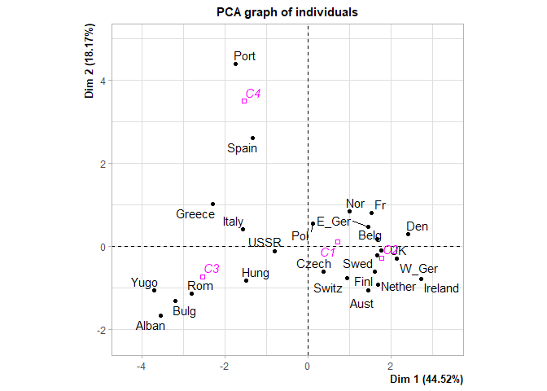
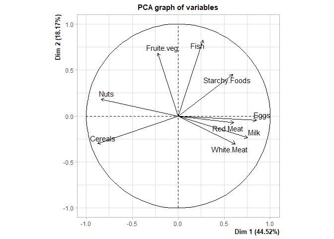
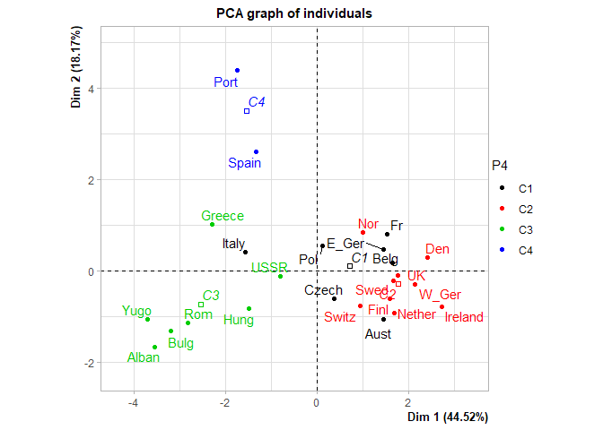

TP CENTRES MOBILES (K-MEANS)
================

Définition des options générales de knitr.

``` r
#knitr::opts_chunk$set(echo = T, message=F, eval=F, warning = F) # pour éditer le sujet
knitr::opts_chunk$set(echo = T, message=F, eval=T, warning = F) # pour éditer la correction
```

# Récupération des données

A partir du fichier texte, on vérifie d’abord que le fichier est bien
accessible :

``` r
dir()
```

    ## [1] "ind1234.txt"      "kmeans.Rproj"     "README.md"        "README1.rmd"     
    ## [5] "README2.rmd"      "TP_Kmeans_files"  "TP_Kmeans0.Rmd"   "TP_Kmeans0_files"

Puis on l’importe :

``` r
X<-read.table(file="ind1234.txt",sep="\t",header=TRUE,dec=",",row.names=1)
```

Affichage pour vérification :

``` r
knitr::kable(X)
```

|      | var1 | var2 |
| ---- | ---: | ---: |
| ind1 |    5 |    4 |
| ind2 |    4 |    5 |
| ind3 |    1 |  \-2 |
| ind4 |    0 |  \-3 |

# Calcul des distances

``` r
d=dist(X)
d
```

    ##          ind1     ind2     ind3
    ## ind2 1.414214                  
    ## ind3 7.211103 7.615773         
    ## ind4 8.602325 8.944272 1.414214

# CENTRES MOBILES (K-MEANS) SUR L’EXERCICE DE TD

Pour avoir une aide sur la fonction kmeans :

``` r
help(kmeans)
```

## Initialisation

``` r
init<-X[1:2,] 
```

ind1 et ind2 sont les centres initiaux

ou bien :

``` r
init=X[c(1,2),]
```

Vérification :

``` r
knitr::kable(init)
```

|      | var1 | var2 |
| ---- | ---: | ---: |
| ind1 |    5 |    4 |
| ind2 |    4 |    5 |

## Appel de la fonction kmeans

avec ind1 et ind2 comme centres initiaux

``` r
result=kmeans(X,centers=init) 
```

``` r
result
```

    ## K-means clustering with 2 clusters of sizes 2, 2
    ## 
    ## Cluster means:
    ##   var1 var2
    ## 1  0.5 -2.5
    ## 2  4.5  4.5
    ## 
    ## Clustering vector:
    ## ind1 ind2 ind3 ind4 
    ##    2    2    1    1 
    ## 
    ## Within cluster sum of squares by cluster:
    ## [1] 1 1
    ##  (between_SS / total_SS =  97.0 %)
    ## 
    ## Available components:
    ## 
    ## [1] "cluster"      "centers"      "totss"        "withinss"     "tot.withinss"
    ## [6] "betweenss"    "size"         "iter"         "ifault"

## Affichage de la partition

``` r
P2 <- result$cluster
P2
```

    ## ind1 ind2 ind3 ind4 
    ##    2    2    1    1

## Inertie totale

``` r
result$totss
```

    ## [1] 67

## Inertie intra-classe W

``` r
result$tot.withinss
```

    ## [1] 2

## Inertie inter-classes B

``` r
result$betweenss
```

    ## [1] 65

## Pourcentage d’Inertie expliqué par la partition

``` r
round((1-result$tot.withinss/result$totss)*100,2)
```

    ## [1] 97.01

## Nombre d’individus dans chaque classe

``` r
result$size
```

    ## [1] 2 2

## Nombre d’itérations

``` r
result$iter 
```

    ## [1] 1

# CENTRES MOBILES (K-MEANS) SUR L’EXEMPLE DU COURS (PROTEIN)

## Récupération et affichage des données

``` r
library(PCAmixdata)
data(protein)
knitr::kable(head(protein))
```

|          |    Red.Meat |    White.Meat |     Eggs |     Milk |   Fish |     Cereals |   Starchy.Foods |   Nuts |                                                     Fruite.veg. |
| -------- | ----------: | ------------: | -------: | -------: | -----: | ----------: | --------------: | -----: | --------------------------------------------------------------: |
| Alban    |        10.1 |           1.4 |      0.5 |      8.9 |    0.2 |        42.3 |             0.6 |    5.5 |                                                             1.7 |
| Aust     |         8.9 |          14.0 |      4.3 |     19.9 |    2.1 |        28.0 |             3.6 |    1.3 |                                                             4.3 |
| Belg     |        13.5 |           9.3 |      4.1 |     17.5 |    4.5 |        26.6 |             5.7 |    2.1 |                                                             4.0 |
| Bulg     |         7.8 |           6.0 |      1.6 |      8.3 |    1.2 |        56.7 |             1.1 |    3.7 |                                                             4.2 |
| Czech    |         9.7 |          11.4 |      2.8 |     12.5 |    2.0 |        34.3 |             5.0 |    1.1 |                                                             4.0 |
| Den      |        10.6 |          10.8 |      3.7 |     25.0 |    9.9 |        21.9 |             4.8 |    0.7 |                                                             2.4 |
| Les donn | ées décrive | nt la quantit | é de pr | otéines | consom | mée dans 9 | types d’aliment | s dans | 25 pays européens : 25 individus et 9 variables quantitatives. |

## Algorithme des centres mobiles pour obtenir une partition en 4 classes

On lance l’algo 5 fois avec initialisation aléatoire :

``` r
res <- kmeans(protein,centers=4,nstart=5) 
P4 <- res$cluster
P4
```

    ##   Alban    Aust    Belg    Bulg   Czech     Den   E_Ger    Finl      Fr  Greece 
    ##       3       1       1       3       1       2       1       2       1       3 
    ##    Hung Ireland   Italy  Nether     Nor     Pol    Port     Rom   Spain    Swed 
    ##       3       2       1       2       2       1       4       3       4       2 
    ##   Switz      UK    USSR   W_Ger    Yugo 
    ##       2       2       3       2       3

## Pourcentage d’Inertie expliqué par la partition

``` r
round((1-res$tot.withinss/res$totss)*100,2)
```

    ## [1] 72.33

## ACP normée pour visualiser les classes et mieux les interpréter

### Création d’une variable qualitative contenant la classe Ck d’appartenance de chaque individu donnée par P4

``` r
str(P4) #P4 contient pour l'instant des entiers
```

    ##  Named int [1:25] 3 1 1 3 1 2 1 2 1 3 ...
    ##  - attr(*, "names")= chr [1:25] "Alban" "Aust" "Belg" "Bulg" ...

``` r
P4<-as.factor(P4)
P4
```

    ##   Alban    Aust    Belg    Bulg   Czech     Den   E_Ger    Finl      Fr  Greece 
    ##       3       1       1       3       1       2       1       2       1       3 
    ##    Hung Ireland   Italy  Nether     Nor     Pol    Port     Rom   Spain    Swed 
    ##       3       2       1       2       2       1       4       3       4       2 
    ##   Switz      UK    USSR   W_Ger    Yugo 
    ##       2       2       3       2       3 
    ## Levels: 1 2 3 4

``` r
str(P4) #P4 est maintenant une variable quali
```

    ##  Factor w/ 4 levels "1","2","3","4": 3 1 1 3 1 2 1 2 1 3 ...
    ##  - attr(*, "names")= chr [1:25] "Alban" "Aust" "Belg" "Bulg" ...

``` r
levels(P4)<-paste("C",1:4,sep="") 
levels(P4) #la valeur k devient maintenant Ck
```

    ## [1] "C1" "C2" "C3" "C4"

### Affichage des contenus de chaque classe

``` r
pays=row.names(protein)
pays
```

    ##  [1] "Alban"   "Aust"    "Belg"    "Bulg"    "Czech"   "Den"     "E_Ger"  
    ##  [8] "Finl"    "Fr"      "Greece"  "Hung"    "Ireland" "Italy"   "Nether" 
    ## [15] "Nor"     "Pol"     "Port"    "Rom"     "Spain"   "Swed"    "Switz"  
    ## [22] "UK"      "USSR"    "W_Ger"   "Yugo"

``` r
pays[which(P4=="C1")]
```

    ## [1] "Aust"  "Belg"  "Czech" "E_Ger" "Fr"    "Italy" "Pol"

``` r
pays[which(P4=="C2")]
```

    ## [1] "Den"     "Finl"    "Ireland" "Nether"  "Nor"     "Swed"    "Switz"  
    ## [8] "UK"      "W_Ger"

``` r
pays[which(P4=="C3")]
```

    ## [1] "Alban"  "Bulg"   "Greece" "Hung"   "Rom"    "USSR"   "Yugo"

``` r
pays[which(P4=="C4")]
```

    ## [1] "Port"  "Spain"

### ACP normée en ajoutant la variable qualitative comme variable illustrative

``` r
library(FactoMineR)
ResACP=PCA(data.frame(P4,protein),scale.unit=T,quali.sup=1,ncp=5,graph=T)
```

<!-- --><!-- -->

``` r
plot(ResACP, axes=c(1,2), choix="ind",habillage=1)#les individus sont maintenant colorés selon leur classe d'appartenance
```

<!-- -->

### Si on veut afficher les données centrées-réduites

``` r
n<-nrow(protein)
#on centre et on réduit les données avec la fonction scale et on appelle Z la matrice des données centrées-réduites :
Z <- scale(protein, center=TRUE, scale=TRUE)*sqrt(n/(n-1)) 
#NB : Dans la fonction scale, la réduction se fait en divisant par la racine carrée de la variance sans biais (avec 1/(n-1)), appelée "var" dans R. Pour avoir les résultas classiques de réduction il faut donc multiplier les valeurs par la racine de (n/(n-1))
round(head(Z),2)
```

    ##       Red.Meat White.Meat  Eggs  Milk  Fish Cereals Starchy.Foods  Nuts
    ## Alban     0.08      -1.79 -2.22 -1.18 -1.23    0.93         -2.30  1.25
    ## Aust     -0.28       1.69  1.25  0.40 -0.66   -0.40         -0.42 -0.91
    ## Belg      1.12       0.39  1.06  0.06  0.06   -0.53          0.89 -0.50
    ## Bulg     -0.62      -0.52 -1.22 -1.27 -0.93    2.27         -1.98  0.32
    ## Czech    -0.04       0.97 -0.12 -0.66 -0.69    0.19          0.45 -1.01
    ## Den       0.24       0.80  0.70  1.13  1.68   -0.96          0.33 -1.22
    ##       Fruite.veg.
    ## Alban       -1.38
    ## Aust         0.09
    ## Belg        -0.08
    ## Bulg         0.04
    ## Czech       -0.08
    ## Den         -0.98

``` r
#Vérifions que dans Z les colonnes sont de moyenne 1 et de variance 
round(apply(Z,2,mean),4) #les moyennes sont nulles
```

    ##      Red.Meat    White.Meat          Eggs          Milk          Fish 
    ##             0             0             0             0             0 
    ##       Cereals Starchy.Foods          Nuts   Fruite.veg. 
    ##             0             0             0             0

``` r
ectyp_n <- function(x) sqrt(var(x)*((length(x)-1)/length(x)))
apply(Z,2,ectyp_n) # les écart-types sont égaux à 1
```

    ##      Red.Meat    White.Meat          Eggs          Milk          Fish 
    ##             1             1             1             1             1 
    ##       Cereals Starchy.Foods          Nuts   Fruite.veg. 
    ##             1             1             1             1
